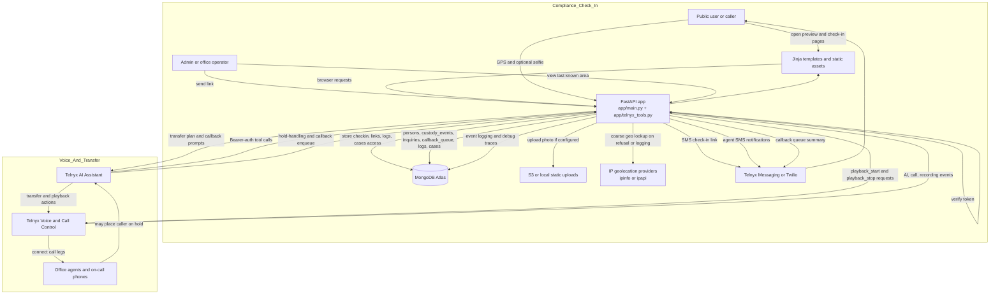

# AI Agent Warrant System Flow Ground Truth

Added: 2026-05-01  
Status: Derived from current code paths in `app/main.py` and `app/telnyx_tools.py`

## Overview

This diagram shows the as-built request and data flow for the current service. It covers both major subsystems:

- compliance check-in,
- Telnyx voice operations.

## Flow Notes

### Compliance Flow

- The service generates time-limited JWT-based check-in links.
- The check-in page attempts both GPS and a selfie capture.
- Refusals are explicitly recorded.
- The admin map is driven by the most recent stored geo event.

### Voice Operations Flow

- Telnyx tools are authenticated with a bearer token.
- The app uses fast-path simple county collections when available, then falls back to canonical person and custody collections.
- Transfer planning is schedule-aware and county-aware.
- Warm transfer responses include DTMF choices and hold music metadata.
- The callback queue is a first-in, first-out Mongo-backed operational queue.

### Logging Model

- The `logs` collection is the cross-cutting event sink.
- It captures playback actions, webhook payloads, SMS attempts, routing diagnostics, and compliance events.

## Canonical Source Files

- `app/main.py`
- `app/telnyx_tools.py`
- `app/db.py`
- `app/config.py`
- `app/sms.py`
- `app/storage.py`
- `app/tokens.py`
- `app/geo.py`